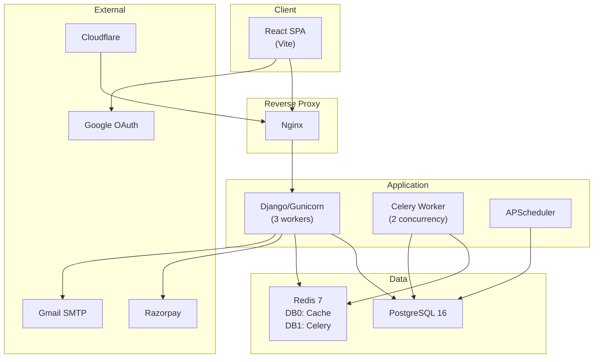

# SLOTIFYNEST — COMPLETE CODEBASE + FRONTEND/UX MASTER ANALYSIS

> **Generated**: 2026-09-11 | **Branch**: `main` (commit `960025e`) | **Status**: Clean working tree, no uncommitted changes.

---

## 1. Executive Summary

SlotifyNest is a **multi-vertical property discovery, booking, and management SaaS platform** serving five canonical property categories: PG & Co-Living, Hotels, Resorts, Farmhouses, and Convention/Banquet Halls. It is a production-deployed application at `slotifynest.cloud`.

**Architecture**: Django REST backend (PostgreSQL, Redis, Celery, APScheduler) + React/Vite SPA frontend. Deployed via Docker Compose behind Nginx with Cloudflare.

**Users**: Four backend roles — `SUPER_ADMIN`, `ADMIN` (property owner), `WARDEN` (staff), `TENANT` (customer/guest). Plus `NONE` (pending approval).

**Current State**: The backend is mature with extensive booking, payment (Razorpay + Direct UPI), notification, subscription, and multi-domain API systems. The frontend is functional but has significant UX, mobile responsiveness, and design consistency problems. Many feature files are **monolithic** (100-320 KB single JSX files).

**Key Insight for Emergent**: The frontend uses a **domain-based delegation pattern** — a single route like `/dashboard` or `/apply/:pgId` delegates to completely different components based on `property_type` (PG, Hotel, Resort, Farmhouse, Venue). This means the frontend effectively contains **5 parallel UI systems** inside one app.

---

## 2. Technology Stack

| Layer | Technology | Version/Details |
|-------|-----------|-----------------|
| **Frontend Framework** | React | 19.2.5 |
| **Build Tool** | Vite | 5.4.21 |
| **Package Manager** | npm | package-lock.json present |
| **Routing** | react-router-dom | 7.14.2 |
| **HTTP Client** | axios | 1.15.2 |
| **UI Animation** | framer-motion | 12.43.0 |
| **Icons** | react-icons (HeroIcons) + lucide-react | 5.6.0 / 1.28.0 |
| **Charts** | recharts | 3.8.1 |
| **3D** | three.js + @react-three/fiber + drei | 0.184.0 (used for WelcomeScreen only) |
| **CSS** | Vanilla CSS with CSS custom properties | No framework (no Tailwind) |
| **Backend** | Django + Django REST Framework | With SimpleJWT |
| **Database** | PostgreSQL | 16-alpine |
| **Cache** | Redis | 7-alpine (DB 0 = cache, DB 1 = Celery) |
| **Task Queue** | Celery | Worker + APScheduler |
| **Payment** | Razorpay + Direct UPI | Dual gateway, configurable |
| **Auth** | JWT (access 30min / refresh 7 days) | Google OAuth supported |
| **Deployment** | Docker Compose + Nginx + Cloudflare | GHCR images |

---

## 3. Complete Repository Structure

```
pgflow/
├── backend/                    # Django application
│   ├── apps/                   # All Django apps
│   │   ├── accounts/           # User model, auth, site config
│   │   ├── api/                # Domain-specific URL routers (hotel_urls, resort_urls, etc.)
│   │   ├── analytics/          # Dashboard analytics
│   │   ├── bookings/           # Booking + Offer + GuestService + Activity + Housekeeping + SeasonalRate models
│   │   ├── core/               # Shared core utilities
│   │   ├── documents/          # Document management
│   │   ├── farmhouse/          # Farmhouse domain extension
│   │   ├── finance/            # Payment, expense, ledger, Razorpay, receipts, refunds
│   │   ├── food/               # Food menu management
│   │   ├── hotel/              # Hotel domain extension
│   │   ├── maintenance/        # Maintenance ticket system
│   │   ├── notifications/      # In-app + push + chat notifications
│   │   ├── pg/                 # Core PG model + photos + reviews + packages
│   │   ├── pg_domain/          # PG domain-specific extension
│   │   ├── resort/             # Resort domain extension
│   │   ├── rooms/              # Room/bed management
│   │   ├── subscriptions/      # SaaS subscription plans + payments
│   │   ├── tenants/            # Tenant/application management
│   │   ├── utilities/          # System utilities
│   │   └── venue/              # Venue domain extension
│   ├── config/                 # Django settings, URLs, WSGI, Celery, Cache
│   ├── manage.py
│   └── requirements.txt
├── frontend/                   # React SPA
│   ├── src/
│   │   ├── api/client.js       # Axios instance with JWT + refresh + error sanitization
│   │   ├── App.jsx             # Route definitions + ProtectedRoute + RoleRoute
│   │   ├── main.jsx            # Entry point + SW registration
│   │   ├── index.css           # 3173-line master CSS with design tokens
│   │   ├── site-improvements.css # 47KB additional CSS overrides
│   │   ├── components/         # Reusable components
│   │   ├── context/            # AuthContext, PGContext, SiteConfigContext, ThemeContext, ToastContext
│   │   ├── constants/          # propertyCategories.jsx
│   │   ├── features/           # Domain-specific mega-components (pg/, hospitality/, resort/, venue/)
│   │   ├── hooks/              # usePropertyConfig, useNetworkStatus, useToast
│   │   ├── pages/              # Route-level page components
│   │   ├── shared/             # Placeholder directories (README.md only)
│   │   ├── core/               # Placeholder re-exports (not actively used)
│   │   ├── styles/             # landing.css, customer.css
│   │   └── utils/              # apiUtils, errorUtils, formUtils, googleAuth, razorpay, storageUtils
│   ├── public/                 # Static assets (logo, manifest, sw.js)
│   ├── package.json
│   └── vite.config.js
├── docker-compose.yml          # 6 services: db, redis, backend, celery-worker, scheduler, frontend, nginx
├── nginx/                      # Nginx reverse proxy config
├── certbot/                    # SSL certificate management
├── scripts/                    # Deployment and utility scripts
├── docs/                       # Documentation
└── architecture/               # Architecture documentation
```

---

## 4. System Architecture



**Key architectural facts:**
- Frontend proxies `/api` requests to backend via Vite dev proxy (localhost) or Nginx (production)
- JWT stored in `localStorage` as `tokens` object `{access, refresh}`
- User object cached in `localStorage` as `user`
- Active property cached in `localStorage` as `activePG`
- Theme preference cached in `localStorage` as `theme`
- Site config cached in `localStorage` as `slotifynest_site_config`
- Two payment gateways: Razorpay (full integration) and Direct UPI (owner QR code)
- Active gateway set by `ACTIVE_PAYMENT_GATEWAY` server setting

---

## 5. Frontend Architecture

### Provider Hierarchy (App.jsx)
```
BrowserRouter
  └─ ThemeProvider          # Light/dark theme
    └─ SiteConfigProvider   # Dynamic branding from /api/site-config/
      └─ AuthProvider       # JWT auth state, login/register/logout
        └─ ToastProvider    # Toast notifications
          └─ GlobalErrorBoundary
            └─ Routes
              ├─ PublicRoute (unauthenticated only)
              │   ├─ / (LandingPage)
              │   ├─ /login (LoginPage)
              │   ├─ /register (LoginPage)
              │   └─ /pricing (PricingPage)
              ├─ Public booking routes (mixed auth)
              │   ├─ /apply/:pgId
              │   ├─ /book-farmhouse/:pgId
              │   ├─ /book-hall/:pgId
              │   ├─ /book-hotel/:pgId
              │   └─ /book-resort/:pgId
              └─ ProtectedRoute → PGProvider
                  ├─ TENANT → CustomerKYCModal check → TenantPortal
                  ├─ NONE → PendingRoleScreen
                  ├─ ADMIN (unapproved) → PendingRoleScreen
                  └─ ADMIN/WARDEN → Sidebar layout + child routes
```

### State Management
- **No Redux/Zustand** — pure React Context + useState/useEffect
- 5 Context providers: Auth, PG, SiteConfig, Theme, Toast
- `PGContext` polls background counts (notifications, pending apps, tickets) every 30s
- `AuthContext` polls `/auth/me/` every 10s to detect role/approval changes

### API Layer
- Single axios instance in `src/api/client.js`
- JWT auto-attach via request interceptor
- Single-flight token refresh with queue on 401
- Auto-retry on Cloudflare 502/520-526 errors
- Error message sanitization (strips Django tracebacks)
- FormData multipart boundary auto-detection

### Routing
- `getDomainUrl(activePG, path)` in `src/utils/apiUtils.js` resolves property-type-specific API paths
  - HOTEL → `/hotel/{id}/{path}`
  - RESORT → `/resort/{id}/{path}`
  - FARMHOUSE → `/farmhouse/{id}/{path}`
  - CONVENTIONAL_HALL → `/venue/{id}/{path}`
  - PG → `/pg/{id}/{path}`

---

## 6. Frontend Route Map

### PUBLIC ROUTES (No auth required)

| Route | Component | Purpose |
|-------|-----------|---------|
| `/` | `LandingPage` | Property discovery homepage |
| `/login` | `LoginPage` | Login + Google OAuth |
| `/register` | `LoginPage` | Registration (same component, mode switch) |
| `/pricing` | `PricingPage` | SaaS pricing display |
| `/apply/:pgId` | `ApplyPage` → delegates to PG/Hotel/Venue flow | Public booking (mixed auth) |
| `/book-farmhouse/:pgId` | `ApplyPage` → `VenueApplyFlow` | Farmhouse booking |
| `/book-hall/:pgId` | `ApplyPage` → `VenueApplyFlow` | Convention hall booking |
| `/book-hotel/:pgId` | `ApplyPage` → `HospitalityApplyFlow` | Hotel booking |
| `/book-resort/:pgId` | `ApplyPage` → `HospitalityApplyFlow` | Resort booking |
| `/welcome-demo` | `WelcomeScreenDemo` | Demo page (dev-only) |

### PROTECTED — ADMIN/WARDEN (Property Owner/Staff)

| Route | Component | Roles | Purpose |
|-------|-----------|-------|---------|
| `/dashboard` | `DashboardPage` → delegates | ADMIN, WARDEN, TENANT | Main dashboard |
| `/property-studio` | `PropertyStudioPage` → delegates | ADMIN, WARDEN | Property showcase editor |
| `/rooms` | `RoomsPage` → delegates | ADMIN, WARDEN | Room/bed management |
| `/tenants` | `TenantsPage` | ADMIN, WARDEN | Tenant management |
| `/applications` | `ApplicationsPage` → delegates | ADMIN, WARDEN | Booking/application management |
| `/packages` | `PackagesPage` → delegates | ADMIN | Package management |
| `/finance` | `FinancePage` | ADMIN | Financial dashboard |
| `/wardens` | `WardensPage` | ADMIN | Staff management |
| `/maintenance` | `MaintenancePage` | ADMIN, WARDEN, TENANT | Maintenance tickets |
| `/food-menu` | `FoodMenuPage` | ADMIN, WARDEN, TENANT | Food menu |
| `/alerts` | `AlertsManagerPage` | ADMIN, WARDEN | Scheduled alerts |
| `/messages` | `AdminMessagesPage` | ADMIN, WARDEN | Chat/messaging |
| `/notifications` | `NotificationsPage` | ADMIN, WARDEN, TENANT | Notification center |
| `/subscription` | `SubscriptionPage` | ADMIN | Owner subscription management |
| `/guest-services` | `ResortServicesPage` | ADMIN, WARDEN | Resort guest services |
| `/activities` | `ResortActivitiesPage` | ADMIN, WARDEN | Resort activities |
| `/housekeeping` | `HousekeepingPage` | ADMIN, WARDEN | Hotel/resort housekeeping |
| `/seasonal-pricing` | `SeasonalPricingPage` | ADMIN | Seasonal rate management |

### PROTECTED — SUPER ADMIN

| Route | Component | Purpose |
|-------|-----------|---------|
| `/super-admin/users` | `SuperAdminPage` (tab) | User account management |
| `/super-admin/properties` | `SuperAdminPage` (tab) | Property oversight |
| `/super-admin/plans` | `SuperAdminPage` (tab) | SaaS tier management |
| `/super-admin/payouts` | `SuperAdminPage` (tab) | Payout & fee management |
| `/super-admin/site-config` | `SuperAdminPage` → `SiteConfigurationTab` | Dynamic site configuration |
| `/super-admin/utilities` | `SuperAdminPage` (tab) | Backup & privacy tools |

### REDIRECTS / ALIASES

| Route | Redirects To |
|-------|-------------|
| `/super-admin` | `/super-admin/users` |
| `/users` | `/super-admin/users` |
| `/subscriptions-admin` | `/super-admin/plans` |
| `/bookings` | `/applications` |
| `/hotel-bookings` | `/applications` |
| `/resort-bookings` | `/applications` |
| `/farmhouse-bookings` | `/applications` |
| `/conventional-hall-bookings` | `/applications` |
| `/offers` | `/applications` |
| `*` (catch-all) | `/` |

### Route Guards
- `PublicRoute`: Redirects authenticated users to `/dashboard` (or `/super-admin/users` for SUPER_ADMIN)
- `ProtectedRoute`: Redirects unauthenticated to `/login`; TENANT role forced to `TenantPortal`; NONE role shows `PendingRoleScreen`; unapproved ADMIN shows `PendingRoleScreen`
- `RoleRoute`: Checks `user.role` against allowed roles array

---

## 7. Page-by-Page Functionality

### 7.1 Landing Page (`/`)
- **Component**: `LandingPage.jsx` (176 lines)
- **Sub-components**: `LandingHeader`, `HeroSearch`, `PropertyCategories`, `PropertyGrid`, `HowItWorks`, `TrustSection`, `OwnerSection`, `LandingFAQ`, `LandingFooter`, `CustomerStatusModal`
- **API calls**: `GET /api/pgs/public/list/` — fetches all public properties
- **Data**: Properties filtered in-memory by category, city, search query
- **User actions**: Search properties, filter by category/city, check booking status, navigate to login/register
- **Loading state**: ✅ Present (loading spinner)
- **Error state**: ✅ Present (error message with retry)
- **Empty state**: Handled via `PropertyGrid` (shows `NoSearchResultsState` when filters yield 0)
- **Responsive**: Header has mobile/desktop variants. PropertyGrid uses CSS grid.
- **Mobile issues**: Hero search may be cramped; property cards need review
- **CSS**: `styles/landing.css` (36KB) + `LandingPage.css` (47KB) — **duplicated/split** landing styles

### 7.2 Login / Register Page (`/login`, `/register`)
- **Component**: `LoginPage.jsx` (1027 lines, 44KB — **very large single file**)
- **Modes**: SIGN_IN, SIGN_UP (toggled by URL path or tab click)
- **Account types**: OWNER or CUSTOMER
- **Owner registration**: Shows 5 canonical property categories for role selection + property name + city
- **Auth methods**: Email/password + Google OAuth
- **Features**: OTP verification flow inline, password reset flow, password strength meter
- **API calls**: `POST /api/auth/login/`, `POST /api/auth/register/`, `POST /api/auth/google/`, `POST /api/auth/register/verify/`, `POST /api/auth/register/resend-otp/`, `POST /api/auth/password-reset-request/`, `POST /api/auth/password-reset-confirm/`
- **State**: Loading, error, OTP verify, password reset — all handled inline
- **CSS**: `Auth.css` (23KB)
- **Mobile**: Multi-step registration form may be difficult on small screens
- **Hardcoded data**: Google Client ID hardcoded as fallback

### 7.3 Dashboard (`/dashboard`)
- **Component**: `DashboardPage.jsx` (315 lines) — **pure delegator**
- **Logic**: Determines `property_type` from `activePG` or `user.requested_role`, delegates to:
  - PG → `PGDashboard` (83KB)
  - HOTEL → `HospitalityDashboard` (97KB)
  - RESORT → `ResortDashboard` (71KB)
  - FARMHOUSE/CONVENTIONAL_HALL → `VenueDashboard` (119KB)
  - TENANT role → `TenantPortal`
  - NONE role → `NoneDashboard` (pending approval screen)
- **Dual-view**: ADMIN users who are also tenants elsewhere can switch between admin/tenant views
- **Loading**: Skeleton cards + `LoadingState`
- **Error**: `DashboardErrorBoundary` wraps each vertical dashboard

### 7.4 Tenant/Customer Portal (`TenantPortal.jsx`)
- **Component**: `TenantPortal.jsx` (127 lines) — delegator
- **API**: `GET /api/auth/tenant/dashboard/`
- **Delegates based on property_type**:
  - RESORT → `ResortGuestPortal` (46KB)
  - HOTEL → `HospitalityGuestPortal` (177KB)
  - FARMHOUSE/CONVENTIONAL_HALL → `VenueGuestPortal` (32KB)
  - PG → `PGTenantPortal` (191KB)
- **Bottom nav**: `CustomerBottomNav` component added to all portals
- **Handles**: 404/inactive tenant gracefully

### 7.5 Public Booking Pages (`/apply/:pgId`, `/book-*/:pgId`)
- **Delegator**: `ApplyPage.jsx` (101 lines)
- **API**: `GET /api/pg/{pgId}/info/` → determines property type → delegates:
  - PG → `PGApplyFlow` (223KB — massive)
  - HOTEL/RESORT → `HospitalityApplyFlow` (263KB — massive)
  - FARMHOUSE/CONVENTIONAL_HALL → `VenueApplyFlow` (327KB — largest file in repo)
- **These are the customer-facing booking flows** — each is a multi-step wizard with showcase gallery, room selection, date selection, guest info, payment
- **Mixed auth**: Can work without login (public booking) or with logged-in user (auto-fills info)

### 7.6 Finance Page (`/finance`)
- **Component**: `FinancePage.jsx` (77KB) — **monolithic**
- **Roles**: ADMIN only
- **Covers**: Ledger, payments, expenses, profit/loss, dues, claims, refunds, receipts, platform settings
- **API calls**: Multiple endpoints under `/api/pgs/{id}/ledger/`, `/api/pgs/{id}/payments/`, etc.

### 7.7 Super Admin Page (`/super-admin/:tab`)
- **Component**: `SuperAdminPage.jsx` (79KB, 1635 lines) — **monolithic**
- **Tabs** (via URL param): users, properties, plans, payouts, site-config, utilities
- **Users tab**: List, search, filter, approve/reject, role change, password reset, data scrub, hard delete
- **Properties tab**: View all properties across all owners
- **Plans tab**: Manage SaaS subscription tiers
- **Payouts tab**: Platform fee, reconciliation, transaction oversight
- **Site Config tab**: Delegates to `SiteConfigurationTab` component (45KB)
- **Utilities tab**: Database backup, data privacy tools

### 7.8 Other Pages (Summary)

| Page | Size | Key Function |
|------|------|-------------|
| `TenantsPage` | 41KB | Tenant management with profiles, KYC, move-in/out |
| `WardensPage` | 24KB | Staff management, create wardens, assign to properties |
| `ResortActivitiesPage` | 34KB | Activity creation, catalog, guest activity bookings |
| `AlertsManagerPage` | 24KB | Scheduled alert system |
| `FoodMenuPage` | 23KB | Daily food menu management |
| `NotificationsPage` | 16KB | Notification center, mark read |
| `MaintenancePage` | 16KB | Maintenance ticket CRUD |
| `SubscriptionPage` | 11KB | Owner subscription management |
| `OffersPage` | 43KB | Offer/negotiation management |
| `PricingPage` | 8KB | Public SaaS pricing page |

---

## 8. Component Inventory

### Top-Level Components (`src/components/`)

| Component | Size | Purpose | Used By | Redesign Impact |
|-----------|------|---------|---------|-----------------|
| `Sidebar.jsx` | 12KB | Left navigation drawer (ADMIN/WARDEN) | `ProtectedRoute` (App.jsx) | **REPLACE** — needs mobile-first redesign |
| `UserProfileModal.jsx` | 17KB | User profile editor modal | Sidebar, mobile header | KEEP logic, redesign UI |
| `CustomerKYCModal.jsx` | 20KB | Mandatory KYC for tenants (phone, selfie, Aadhaar) | ProtectedRoute | KEEP — critical business flow |
| `RazorpayCheckoutModal.jsx` | 11KB | Razorpay payment modal | Multiple booking flows | KEEP — payment critical |
| `DirectUpiPaymentModal.jsx` | 25KB | Direct UPI payment flow | Booking flows | KEEP — payment critical |
| `PendingRoleScreen.jsx` | 16KB | Pending/rejected approval screen | ProtectedRoute | Redesign UI only |
| `SlotifyLogo.jsx` | 3KB | Dynamic logo (uses SiteConfig) | Header, sidebar, login | KEEP |
| `ErrorBoundary.jsx` | 1.5KB | React error boundary | ApplyPage | KEEP |
| `ShowcaseGallery.jsx` | 9KB | Property photo gallery | Booking flows | REPLACE with better mobile gallery |
| `ShowcaseLightbox.jsx` | 12KB | Full-screen photo viewer | ShowcaseGallery | REPLACE |
| `FloatingChatWidget.jsx` | 12KB | Chat bubble widget | Dashboard | KEEP or improve |
| `InstallPrompt.jsx` | 9KB | PWA install prompt | App.jsx | KEEP |
| `WelcomeScreen.jsx` | 7KB | Welcome animation | WelcomeScreenDemo | POSSIBLY UNUSED in production |
| `CursorTrail.jsx` | 3KB | Cursor animation effect | Unknown | POSSIBLY UNUSED |
| `OwnerEarningsSection.jsx` | 15KB | Owner earnings display | Dashboard | KEEP logic, redesign |
| `RoomAmenitiesEditor.jsx` | 8KB | Amenity selection editor | Property Studio | KEEP |
| `CreateOwnerPropertyModal.jsx` | 19KB | New property creation | SuperAdmin, Dashboard | KEEP |

### Landing Components (`src/components/landing/`)

| Component | Size | Purpose | Redesign |
|-----------|------|---------|----------|
| `LandingHeader.jsx` | 8KB | Top header with nav | REPLACE |
| `HeroSearch.jsx` | 2.8KB | Hero search bar | REPLACE |
| `PropertyCategories.jsx` | 2.5KB | Category filter tabs | REPLACE |
| `PropertyGrid.jsx` | 5.9KB | Property card grid | REPLACE |
| `PropertyCard.jsx` | 3.9KB | Individual property card | REPLACE |
| `HowItWorks.jsx` | 1.9KB | Steps section | REPLACE |
| `OwnerSection.jsx` | 3.7KB | Owner CTA section | REPLACE |
| `TrustSection.jsx` | 1.8KB | Trust badges section | REPLACE |
| `LandingFAQ.jsx` | 4.8KB | FAQ accordion | REPLACE |
| `LandingFooter.jsx` | 9.4KB | Footer with site config | REPLACE |
| `PropertyTypeGuide.jsx` | 2.6KB | Category info | REPLACE |

### Customer Components (`src/components/customer/`)

| Component | Size | Purpose |
|-----------|------|---------|
| `CustomerHeader.jsx` | 6.5KB | Customer portal header |
| `CustomerHeroSearch.jsx` | 22KB | Full search with filters |
| `CustomerPropertyCard.jsx` | 5KB | Property card for customers |
| `CustomerBottomNav.jsx` | 2.8KB | Mobile bottom navigation |
| `CityQuickBar.jsx` | 3.1KB | City quick-filter bar |
| `CustomerStatusModal.jsx` | 6.8KB | Booking status check |

### UI Components (`src/components/ui/`)

| Component | Size | Purpose | Status |
|-----------|------|---------|--------|
| `states/LoadingState.jsx` | 2.3KB | Loading spinner | ✅ Good — reusable |
| `states/ErrorState.jsx` | 3.5KB | Error display | ✅ Good — reusable |
| `states/EmptyState.jsx` | 2.4KB | Empty state | ✅ Good — reusable |
| `states/OfflineState.jsx` | 1.6KB | Offline indicator | ✅ Present |
| `states/SuccessState.jsx` | 3.2KB | Success confirmation | ✅ Present |
| `states/PermissionDeniedState.jsx` | 1.6KB | 403 state | ✅ Present |
| `states/SessionExpiredState.jsx` | 1.5KB | Session expired | ✅ Present |
| `states/SlowNetworkState.jsx` | 1.9KB | Slow connection | ✅ Present |
| `states/NoSearchResultsState.jsx` | 1.9KB | No results | ✅ Present |
| `states/StateContainer.jsx` | 2.2KB | Container wrapper | ✅ Present |
| `Skeleton.jsx` | 5.6KB | Loading skeletons | ✅ Present |
| `Toast.jsx` | 1.9KB | Toast notification | ✅ Present |
| `NetworkStatus.jsx` | 2.3KB | Online/offline banner | ✅ Present |
| `ImageWithFallback.jsx` | 2.4KB | Image with fallback | ✅ Good |
| `FieldError.jsx` | 0.7KB | Form field error | ✅ Present |
| `InlineError.jsx` | 2.1KB | Inline error message | ✅ Present |

### Feature Components (Domain-Specific)

These are **mega-components** — entire vertical-specific UIs in single files:

| Feature File | Size | Domain | Type |
|-------------|------|--------|------|
| `VenueApplyFlow.jsx` | **327KB** | Farmhouse/Hall | Public booking wizard |
| `HospitalityApplyFlow.jsx` | **263KB** | Hotel/Resort | Public booking wizard |
| `PGApplyFlow.jsx` | **223KB** | PG | Public booking wizard |
| `PGTenantPortal.jsx` | **191KB** | PG | Customer portal |
| `HospitalityGuestPortal.jsx` | **177KB** | Hotel | Customer portal |
| `VenuePropertyStudio.jsx` | **146KB** | Farmhouse/Hall | Property editor |
| `PGPropertyStudio.jsx` | **133KB** | PG | Property editor |
| `VenueDashboard.jsx` | **119KB** | Farmhouse/Hall | Owner dashboard |
| `HospitalityPropertyStudio.jsx` | **119KB** | Hotel | Property editor |
| `HospitalityDashboard.jsx` | **97KB** | Hotel | Owner dashboard |
| `VenueBookingsManager.jsx` | **87KB** | Farmhouse/Hall | Booking management |
| `HospitalityRoomsManager.jsx` | **88KB** | Hotel | Room management |
| `PGDashboard.jsx` | **83KB** | PG | Owner dashboard |
| `PGRoomsManager.jsx` | **79KB** | PG | Room management |
| `PGApplicationsManager.jsx` | **79KB** | PG | Application management |
| `VenueRoomsManager.jsx` | **80KB** | Farmhouse/Hall | Room/space management |
| `ResortDashboard.jsx` | **71KB** | Resort | Owner dashboard |
| `HospitalityBookingsManager.jsx` | **65KB** | Hotel | Booking management |
| `ResortGuestPortal.jsx` | **46KB** | Resort | Customer portal |
| `VenueGuestPortal.jsx` | **32KB** | Farmhouse/Hall | Customer portal |

> [!CAUTION]
> These files are **extremely large single-file components**. They contain entire page flows with embedded styles, state, API calls, and sub-views. Emergent should **not attempt to understand them line-by-line** — understand the delegation pattern and the API contracts they consume.

---

## 9. API / Frontend Contract Map

### Authentication APIs

| Method | Endpoint | Purpose | Auth | Key Response Fields |
|--------|----------|---------|------|-------------------|
| POST | `/api/auth/register/` | User registration | No | `{tokens: {access, refresh}, user: {...}}` |
| POST | `/api/auth/register/verify/` | OTP verification | No | `{tokens, user}` |
| POST | `/api/auth/register/resend-otp/` | Resend OTP | No | `{message}` |
| POST | `/api/auth/login/` | Email login | No | `{tokens: {access, refresh}, user: {id, email, role, ...}}` |
| POST | `/api/auth/google/` | Google OAuth | No | `{tokens, user}` |
| POST | `/api/auth/logout/` | Logout + blacklist | Yes | — |
| POST | `/api/auth/token/refresh/` | JWT refresh | No | `{access, refresh}` |
| GET/PATCH | `/api/auth/me/` | Get/update profile | Yes | Full user object |
| POST | `/api/auth/password-reset-request/` | Request OTP | No | `{message}` |
| POST | `/api/auth/password-reset-confirm/` | Reset with OTP | No | `{message}` |

### Property APIs

| Method | Endpoint | Purpose | Auth |
|--------|----------|---------|------|
| GET | `/api/pgs/public/list/` | Public property listing | No |
| GET | `/api/pgs/` | Owner's properties | Yes |
| GET | `/api/pgs/{id}/info/` | Public property info | No |
| GET | `/api/{domain}/{id}/info/` | Domain-specific public info | No |
| GET/POST | `/api/{domain}/{id}/rooms/` | Room CRUD | Yes |
| GET/POST | `/api/{domain}/{id}/photos/` | Photo CRUD | Yes |
| GET/POST | `/api/{domain}/{id}/reviews/` | Review CRUD | Yes |
| GET | `/api/{domain}/{id}/dashboard/` | Analytics dashboard | Yes |

> **Domain paths**: `/api/hotel/{id}/`, `/api/resort/{id}/`, `/api/farmhouse/{id}/`, `/api/venue/{id}/`, `/api/pg/{id}/`

### Booking APIs

| Method | Endpoint | Purpose | Auth |
|--------|----------|---------|------|
| GET | `/api/public/property/{id}/info/` | Booking page property info | No |
| GET | `/api/public/property/{id}/rooms/` | Available rooms | No |
| POST | `/api/public/property/{id}/book/` | Create booking | No (public) |
| GET | `/api/public/property/{id}/farmhouse/availability/` | Farmhouse date availability | No |
| POST | `/api/public/property/{id}/farmhouse/book/` | Farmhouse booking | No |
| POST | `/api/public/property/{id}/offer/` | Submit price offer | No |
| GET | `/api/public/offer/{token}/status/` | Check offer status | No |
| GET/POST | `/api/pgs/{id}/bookings/` | Booking list/create (owner) | Yes |
| POST | `/api/pgs/{id}/bookings/{id}/approve/` | Approve booking | Yes |
| POST | `/api/pgs/{id}/bookings/{id}/reject/` | Reject booking | Yes |
| POST | `/api/pgs/{id}/bookings/{id}/check-in/` | Check-in guest | Yes |
| POST | `/api/pgs/{id}/bookings/{id}/check-out/` | Check-out guest | Yes |
| POST | `/api/pgs/{id}/bookings/{id}/cancel/` | Cancel booking | Yes |

### Payment APIs

| Method | Endpoint | Purpose | Auth |
|--------|----------|---------|------|
| POST | `/api/razorpay/create-booking-order/` | Create Razorpay order | Yes |
| POST | `/api/razorpay/verify/` | Verify payment | Yes |
| POST | `/api/public/booking/pay-advance/` | Public advance payment | No |
| GET | `/api/pgs/{id}/payments/` | Payment list | Yes |
| GET | `/api/pgs/{id}/ledger/` | Transaction ledger | Yes |
| GET | `/api/pgs/{id}/expenses/` | Expense list | Yes |
| GET | `/api/pgs/{id}/profit/` | Profit summary | Yes |
| GET | `/api/pgs/{id}/dues/` | Due amounts | Yes |
| POST | `/api/claim-offline/` | Claim UPI payment | Yes |
| POST | `/api/approve-offline-claim/` | Approve UPI claim | Yes |
| GET | `/api/checkout-details/` | Checkout pricing | Yes |
| GET | `/api/owner/earnings/` | Owner earnings dashboard | Yes |
| GET | `/api/platform-settings/` | Platform fee config | Yes |

### Other APIs

| Method | Endpoint | Purpose |
|--------|----------|---------|
| GET | `/api/site-config/` | Dynamic site configuration (public) |
| GET/POST | `/api/notifications/` | Notification CRUD |
| GET | `/api/notifications/unread-count/` | Unread count |
| GET/POST | `/api/notifications/scheduled-alerts/` | Scheduled alerts |
| GET/POST | `/api/notifications/push-subscriptions/` | Push notification subscriptions |
| GET/POST | `/api/notifications/chat-messages/` | Chat messaging |
| GET | `/api/auth/tenant/dashboard/` | Tenant dashboard data |
| POST | `/api/auth/tenant/booking/pay-balance/` | Pay remaining balance |
| GET | `/api/subscriptions/` | Subscription plans |
| POST | `/api/subscriptions/subscribe/` | Subscribe to plan |
| GET | `/api/auth/users/` | User list (SUPER_ADMIN) |
| PATCH | `/api/auth/users/{id}/` | Manage user (SUPER_ADMIN) |
| GET | `/api/auth/super-admin/dashboard/` | Admin dashboard stats |
| POST/PATCH | `/api/auth/super-admin/site-config/` | Admin site config CRUD |

---

## 10. Backend Dependencies Relevant to Frontend

### User Model (`apps/accounts/models.py`)
```
CustomUser fields:
  email (unique, login identifier)
  role: SUPER_ADMIN | ADMIN | WARDEN | TENANT | NONE
  approval_status: PENDING | APPROVED | REJECTED
  is_approved: bool (synced with approval_status)
  phone, profile_photo, aadhaar_card, aadhaar_number
  is_kyc_completed, preferred_theme
  requested_role (e.g. "PG_OWNER", "HOTEL_OWNER")
```

### Property Model (`apps/pg/models.py`)
```
PG fields:
  property_type: PG | HOTEL | RESORT | FARMHOUSE | CONVENTIONAL_HALL
  name, address, city, area
  owner (FK to User), wardens (M2M to User)
  plan: FREE | PRO | ENTERPRISE
  subscription_plan (FK to SubscriptionPlan)
  amenities (JSONField), highlights (JSONField)
  rating, review_count (admin-managed)
  upi_id, payment_qr_code, upi_payee_name, payment_instructions
  enable_offers, offer_expiry_hours
  theme_color, custom_photo_categories, disabled_photo_categories
  qr_code, is_active, is_verified
```

### Booking Model (`apps/bookings/models.py`)
```
Booking (Hotel/Resort):
  pg, room, user, guest_name, guest_email, guest_phone
  check_in, check_out, num_guests
  status: PENDING_APPROVAL → APPROVED_AWAITING_PAYMENT → PAYMENT_COMPLETED → CHECKED_IN → CHECKED_OUT
  payment_status: PENDING | ADVANCE_PAID | PARTIALLY_PAID | FULLY_PAID
  total_amount, advance_amount, platform_fee, final_amount
  razorpay fields, offer link

FarmhouseBooking (Farmhouse/Hall):
  Similar structure with event_date, event_type, purpose, num_attendees
```

### Payment Architecture (CRITICAL)
The backend enforces a **financial invariant**:
- `total_amount` = Owner's listed price (what the owner receives)
- `platform_fee` = SlotifyNest commission (added on top)
- `customer_payable` = `total_amount + platform_fee`
- The frontend **must display** amounts from the API, never calculate them

---

## 11. Authentication Architecture

### Flow
1. **Registration**: Email + password + role selection → OTP sent to email → `POST /api/auth/register/verify/` → JWT tokens issued
2. **Login**: `POST /api/auth/login/` → `{tokens: {access, refresh}, user}` → stored in localStorage
3. **Google OAuth**: GSI library → credential → `POST /api/auth/google/` → same response format
4. **Token refresh**: On 401, single-flight refresh via `POST /api/auth/token/refresh/` with queued retries
5. **Logout**: `POST /api/auth/logout/` with refresh token → blacklisted on backend → localStorage cleared

### Token Storage
- `localStorage.tokens` = `{access: "...", refresh: "..."}`
- `localStorage.user` = `{id, email, role, ...}`
- Access token: 30-minute lifetime
- Refresh token: 7-day lifetime, rotated on use

### Role-Based Routing
- `SUPER_ADMIN` → `/super-admin/users`
- `ADMIN`, `WARDEN` → `/dashboard` → Sidebar layout
- `TENANT` → `/dashboard` → `TenantPortal` (no sidebar, has `CustomerBottomNav`)
- `NONE` → `PendingRoleScreen` (waiting for admin approval)
- Unauthenticated → `/login`

### KYC Gate (TENANT only)
Before accessing the tenant portal, tenants must complete:
1. Phone number
2. Profile photo/selfie
3. Aadhaar card/number

If any is missing, `CustomerKYCModal` is forced full-screen.

### Auth Polling
- `AuthContext` polls `/api/auth/me/` every **10 seconds** to detect:
  - Role changes
  - Approval status changes
  - Account deactivation
  - Theme preference changes

---

## 12. Customer Journey

```
Landing Page (/)
  ↓ [Browse/Search properties]
Property Card (click)
  ↓ [Navigate to booking page]
/apply/{id} or /book-hotel/{id}
  ↓ [ApplyPage delegates by property_type]
Booking Flow (PGApplyFlow / HospitalityApplyFlow / VenueApplyFlow)
  Step 1: Property showcase (photos, description, amenities, reviews)
  Step 2: Room/date selection
  Step 3: Guest information (auto-fills if logged in)
  Step 4: Package selection (if applicable)
  Step 5: Payment summary (amounts from API)
  Step 6: Payment (Razorpay or Direct UPI)
  ↓ [Booking created]
Confirmation / Status page
  ↓ [Login or check status]
Tenant Portal (/dashboard as TENANT)
  ↓ [PGTenantPortal / HospitalityGuestPortal / etc.]
  - View active bookings
  - Room key / check-in details
  - Payment history
  - Maintenance requests
  - Food menu
  - Profile / KYC
```

### Customer Journey UX Issues
- No persistent booking status tracking for unauthenticated users (only `CustomerStatusModal` on landing)
- The booking flow components are massive monoliths — slow to load, hard to navigate on mobile
- No breadcrumb navigation in multi-step booking
- Payment success/failure UX is functional but not polished
- No favorites/wishlist system
- No booking modification/cancellation from customer side in the main flow

---

## 13. Property Owner Journey

```
Register as Owner (/register)
  ↓ [Select property category, provide details]
Pending Approval (PendingRoleScreen)
  ↓ [Super Admin approves]
Dashboard (/dashboard)
  ↓ [Property-type-specific dashboard loads]
Property Studio (/property-studio)
  ↓ [Configure property, upload photos, set amenities]
Rooms (/rooms)
  ↓ [Create rooms/beds, set pricing]
Packages (/packages)
  ↓ [Create booking packages]
Applications/Offers (/applications)
  ↓ [View, approve, reject bookings]
Finance (/finance)
  ↓ [View payments, expenses, ledger]
Tenants (/tenants)
  ↓ [Manage current tenants]
Staff (/wardens)
  ↓ [Manage wardens/staff]
Settings
  ↓ [Profile, subscription, notifications]
```

### Owner-Specific Issues
- Property Studio is a monolithic editor (100-146KB)
- No guided onboarding wizard for new owners
- Dashboard metrics are complex but may overwhelm new users
- Subscription management UX is basic
- No clear visual hierarchy separating daily tasks from configuration

---

## 14. Super Admin Journey

```
Login → /super-admin/users
  ↓
Tab Navigation (URL-based):
  /super-admin/users         — User account management
  /super-admin/properties    — Platform-wide property oversight
  /super-admin/plans         — SaaS tier configuration
  /super-admin/payouts       — Payment reconciliation
  /super-admin/site-config   — Dynamic branding & SEO
  /super-admin/utilities     — Backup, privacy, data management
```

- Entire admin UI is in a single 79KB `SuperAdminPage.jsx`
- Tab switching via URL params (`useParams`)
- Site config uses dedicated `SiteConfigurationTab.jsx` (45KB)
- Role protection: `RoleRoute` checks for `SUPER_ADMIN`

---

## 15. Booking Flow

### Hotel/Resort Booking
1. Customer visits `/book-hotel/{id}` or `/book-resort/{id}`
2. `ApplyPage` fetches property info from `GET /api/pg/{id}/info/` (via `getDomainUrl`)
3. Delegates to `HospitalityApplyFlow` — a multi-step wizard:
   - Property showcase (photos, reviews, amenities)
   - Room selection with availability check
   - Date selection (check-in/check-out)
   - Guest details form
   - Package selection
   - Payment summary (total + platform fee displayed from API)
   - Payment via Razorpay or Direct UPI
4. On success → confirmation screen
5. Backend creates booking with status `PENDING_APPROVAL`

### PG Booking
1. Customer visits `/apply/{id}`
2. Delegates to `PGApplyFlow` — multi-step:
   - Property showcase
   - Room/bed selection
   - Duration selection (move-in date, duration)
   - Personal details + documents
   - Payment
3. Creates tenant application

### Farmhouse/Hall Booking
1. Customer visits `/book-farmhouse/{id}` or `/book-hall/{id}`
2. Delegates to `VenueApplyFlow`:
   - Property showcase
   - Date selection with calendar availability
   - Event details (type, purpose, attendees)
   - Add-on services
   - Payment summary
   - Payment

### Booking Status Lifecycle
```
PENDING_APPROVAL → (owner approves) → APPROVED_AWAITING_PAYMENT
                 → (owner rejects) → REJECTED
APPROVED_AWAITING_PAYMENT → (payment) → PAYMENT_COMPLETED
PAYMENT_COMPLETED → (check-in) → CHECKED_IN
CHECKED_IN → (check-out) → CHECKED_OUT
Any active → (cancel) → CANCELLED
```

---

## 16. Payment Flow

### Razorpay Flow
1. Frontend calls `POST /api/razorpay/create-booking-order/` with `{booking_id, amount}`
2. Backend creates Razorpay order, returns `{key_id, order_id, amount, currency, ...}`
3. Frontend opens Razorpay checkout widget
4. On payment success, frontend calls `POST /api/razorpay/verify/` with `{razorpay_order_id, razorpay_payment_id, razorpay_signature}`
5. Backend verifies signature, updates booking status

### Direct UPI Flow
1. Frontend shows owner's UPI QR code + payment details from property config
2. Customer pays via any UPI app
3. Customer uploads payment screenshot/UTR via `POST /api/claim-offline/`
4. Owner verifies and approves via `POST /api/approve-offline-claim/`

### Payment Business Rules (CRITICAL)
- **Backend is authoritative for all amounts** — frontend MUST NOT calculate totals
- Owner listed amount → what owner receives
- Platform fee → added on top → what customer pays
- `checkout-details/` API returns the authoritative breakdown
- Frontend only displays, never computes

---

## 17. Subscription Flow

- Owner navigates to `/subscription`
- `SubscriptionPage.jsx` fetches plans from `GET /api/subscriptions/plans/`
- Owner selects plan → `POST /api/subscriptions/subscribe/`
- Payment via Razorpay subscription (recurring)
- Plans: FREE, PRO, ENTERPRISE with limits on properties and beds
- Super Admin manages plans at `/super-admin/plans`

---

## 18. Notification Flow

- `PGContext` checks `/api/notifications/unread-count/` every 30 seconds
- `NotificationsPage.jsx` lists all notifications
- Push notifications via Service Worker (`PushNotificationManager.jsx`)
- VAPID key fetched from `/api/notifications/vapid-key/`
- `AlertsManagerPage.jsx` — scheduled recurring alerts
- `AdminMessagesPage.jsx` — chat messaging system
- `FloatingChatWidget.jsx` — floating chat bubble

---

## 19. Dynamic Site Configuration

### How It Works
1. `SiteConfigContext` fetches `GET /api/site-config/` on app load (public, no auth)
2. Response merged with `DEFAULT_CONFIG` defaults
3. Cached in `localStorage` as `slotifynest_site_config`
4. Used throughout app for: site name, logos, favicon, tagline, support email, SEO meta tags, footer text, social links

### Consumed By
- `SlotifyLogo` component (logo_url, logo_dark_url)
- `LandingHeader`, `LandingFooter` (site name, contact, social)
- Document head (meta title, description, favicon, OG tags)
- `Auth.css` / `LoginPage` (login logo)

### Admin Management
- `SiteConfigurationTab.jsx` (45KB) in Super Admin
- `POST/PATCH /api/auth/super-admin/site-config/` with FormData (logo uploads)
- Supports: logo, dark logo, favicon, app icon, login logo, email logo + all text fields

### Key Fields
```
site_name, site_tagline, site_description
logo_url, logo_dark_url, favicon_url, app_icon_url, login_logo_url, email_logo_url
support_email, support_phone, business_email, business_phone, business_address
city, state, country, pincode, website_url
facebook_url, instagram_url, twitter_url, linkedin_url, youtube_url
meta_title, meta_description, meta_keywords
og_title, og_description, og_image_url
footer_text, copyright_text
```

---

## 20. Current Design System

### CSS Architecture
- **No CSS framework** — pure vanilla CSS
- Main file: `index.css` (3173 lines, 73KB) — contains ALL design tokens + global styles
- Additional: `site-improvements.css` (47KB) — layered overrides
- Page-specific: `Auth.css`, `LandingPage.css`, `PropertyShowcase.css`, `Sidebar.css`, etc.
- Feature-specific: `ResortActivitiesPage.css`, `ResortGuestPortal.css`, etc.
- Shared: `styles/landing.css`, `styles/customer.css`

### Design Tokens (CSS Custom Properties)
- **Colors**: Full slate palette (gray-50 to gray-950), primary blue scale, semantic colors (success/warning/danger/info)
- **Typography**: Inter (body), Geist (display), loaded from Google Fonts
- **Spacing**: Not systematized — ad-hoc values throughout
- **Border radius**: `--radius-sm` (8px) through `--radius-full` (9999px)
- **Shadows**: `--shadow-sm` through `--shadow-xl`, glass effects
- **Transitions**: `--transition-fast` (150ms) through `--transition-spring` (500ms)

### Theme System
- Light/dark theme via `data-theme` attribute on `<html>` and `<body>`
- Dark theme overrides in `[data-theme='dark']` selector
- Theme toggle persisted to localStorage and synced to backend
- FOUC prevention via inline `<script>` in `index.html`

### Component Patterns
- `.glass-card` — frosted glass card style
- `.btn`, `.btn-primary`, `.btn-secondary` — button system
- `.stat-card` — dashboard metric cards
- Extensive use of inline styles in JSX (inconsistent with CSS system)

### Inconsistencies
- **Inline styles vs CSS**: Most feature components use inline styles extensively rather than CSS classes
- **Two icon libraries**: Both `react-icons` (HeroIcons) and `lucide-react` used interchangeably
- **Duplicated color definitions**: Colors defined in CSS vars AND hardcoded in inline styles
- **No component library**: Every component builds its own button/input/card patterns
- **Landing page has 3 CSS files**: `LandingPage.css`, `styles/landing.css`, `PropertyShowcase.css`

---

## 21. Mobile UX Audit

### P0 — Critical

| Issue | Location | Impact |
|-------|----------|--------|
| **Booking flow components are 200-327KB single files** | `features/*/ApplyFlow.jsx` | Cannot lazy-load individual steps; entire wizard loads at once |
| **Mobile header conflicts** | `App.jsx` ProtectedRoute | Simple hamburger + logo + profile icon; no contextual navigation |
| **No bottom navigation for owners** | Sidebar.jsx | Sidebar is desktop-first with mobile overlay; owners must always open hamburger |
| **Viewport locked** | `index.html` `maximum-scale=1.0, user-scalable=0` | Prevents zoom — accessibility issue |
| **Tables on mobile** | TenantsPage, FinancePage, WardensPage | Full-width tables overflow on mobile |

### P1 — Major

| Issue | Location | Impact |
|-------|----------|--------|
| **Sidebar overlay UX** | Sidebar.jsx, Sidebar.css | Full-height overlay, no gestures |
| **Large forms on mobile** | LoginPage, KYCModal, booking flows | Long forms with no step indicators |
| **Photo galleries** | ShowcaseGallery.jsx | Gallery not optimized for touch/swipe |
| **Dashboard cards** | DashboardPage, feature dashboards | Complex stat cards may stack poorly |
| **Modal overflow** | Various modals | Modals may exceed viewport on small screens |

### P2 — Important

| Issue | Location | Impact |
|-------|----------|--------|
| **No pull-to-refresh** | Any list page | Users expect mobile pull-to-refresh |
| **Touch targets** | Various buttons and links | Some action buttons are small |
| **Sticky headers** | Landing header | May consume too much vertical space |
| **Search UX** | CustomerHeroSearch.jsx | Complex filter panel on mobile |

---

## 22. Desktop UX Audit

### Issues

| Issue | Location | Severity |
|-------|----------|----------|
| **Sidebar always visible** | Sidebar.jsx (260px fixed) | Takes space from content on smaller desktops |
| **SuperAdmin is a single tab-page** | SuperAdminPage.jsx (79KB) | All admin functionality in one page, no sub-navigation |
| **FinancePage is monolithic** | FinancePage.jsx (77KB) | Complex financial dashboard in one component |
| **No breadcrumbs** | All pages | Users lose context in deep navigation |
| **Inconsistent card sizes** | Dashboard pages | Stat cards, booking cards vary in design per vertical |
| **Large white space in forms** | PropertyStudio, LoginPage | Forms don't use available horizontal space well |

---

## 23. Responsive Architecture

### Current Implementation
- CSS media queries in `index.css` and page-specific CSS
- Primary breakpoint: `768px` (sidebar collapses to overlay)
- Mobile header appears below 768px
- `PropertyGrid` uses CSS grid with `repeat(auto-fill, minmax(300px, 1fr))`
- Some components use `window.innerWidth` checks for conditional rendering
- `CustomerBottomNav` shown only for TENANT role

### Problems
- No consistent breakpoint system
- Media queries scattered across 10+ CSS files
- Feature components use inline styles that can't be media-queried
- No container queries
- Desktop-first design with mobile afterthought

---

## 24. Loading / Error / Empty / Offline State Audit

### State Component Library (✅ EXISTS)
The project has a well-built state component library at `src/components/ui/states/`:
- `LoadingState` — spinner with message/submessage, multiple layouts
- `ErrorState` — error display with retry, secondary action
- `EmptyState` — empty content with action
- `OfflineState` — offline detection
- `SuccessState` — success confirmation
- `PermissionDeniedState` — 403 forbidden
- `SessionExpiredState` — session timeout
- `SlowNetworkState` — slow connection
- `NoSearchResultsState` — no search results
- `StateContainer` — layout wrapper
- `Skeleton` — loading skeletons (card, dashboard, table)

### Coverage Issues
- Feature mega-components (200-327KB) have **internal** loading/error handling that doesn't use the shared state library
- Some pages handle errors with `console.error` and no user-visible feedback
- Payment states (processing, verifying) could be more explicit
- No global error boundary for API failures (only component-level)

---

## 25. Accessibility Audit

### Major Issues

| Issue | Severity |
|-------|----------|
| **Viewport zoom disabled** (`user-scalable=0`) | P0 — WCAG violation |
| **Extensive inline styles** — no semantic classes | P1 |
| **Icon-only buttons** without `aria-label` | P1 |
| **Modal focus trap** — not consistently implemented | P1 |
| **Form labels** — many inputs use placeholders instead of labels | P2 |
| **Color contrast** — dark theme low-contrast text (`--text-muted: #94a3b8`) | P2 |
| **Keyboard navigation** — not tested in most components | P2 |
| **Image alt text** — `ImageWithFallback` has alt prop but property photos may lack it | P2 |
| **Skip navigation** — not present | P3 |

---

## 26. Performance Audit

### Build Architecture
- Vite with manual chunk splitting (good):
  - `vendor-three` (three.js)
  - `vendor-charts` (recharts)
  - `vendor-motion` (framer-motion)
  - `vendor-icons` (react-icons + lucide-react)
  - `vendor-axios`
  - `vendor-react`
- Chunk size warning limit: 1000KB

### Issues

| Issue | Impact |
|-------|--------|
| **Three.js loaded globally** for a single WelcomeScreen demo | Bundle bloat |
| **No route-level code splitting** (no `React.lazy`) | Entire app loaded upfront |
| **Feature files 100-327KB** — monolithic, no splitting | Large initial parse time |
| **AuthContext polls /auth/me/ every 10 seconds** | Unnecessary network traffic |
| **PGContext polls counts every 30 seconds** | Multiple API calls per interval |
| **Two icon libraries** (react-icons + lucide) | Increased icon bundle |
| **3173-line index.css loaded globally** | Large stylesheet |
| **No image optimization** | Property photos served raw |

---

## 27. Frontend Code Quality Audit

### File Classification

| Category | Files | Action |
|----------|-------|--------|
| **KEEP** | `api/client.js`, all Context files, `utils/`, `hooks/`, `components/ui/states/` | Core infrastructure |
| **REFACTOR** | `LoginPage.jsx` (1027 lines), `SuperAdminPage.jsx` (1635 lines), `FinancePage.jsx` | Break into sub-components |
| **REPLACE** | All `features/*/` mega-components (200-327KB) | Rewrite as modular component trees |
| **REPLACE** | All `components/landing/` | Redesign for mobile-first |
| **VERIFY** | `WelcomeScreen.jsx`, `WelcomeScreenDemo.jsx`, `CursorTrail.jsx`, `welcomeScreenAnimations.js` | Possibly unused in production |
| **VERIFY** | `core/api/client.js`, `core/auth/AuthContext.jsx` | Stub re-exports, may be dead code |
| **VERIFY** | `shared/` directories | Only contain README.md files — unused |
| **POSSIBLY UNUSED** | `OffersPage.jsx` (redirected to `/applications`), `RegisterPage.jsx` (105 bytes, likely stub) | Routes redirect away from these |
| **DEAD CODE** | Various files in `frontend/` root: `add_animations.cjs`, `fix_accent.cjs`, `lint_output.txt`, `lint_final.txt` | Utility/debug files |

### Naming Issues
- Backend uses "PG" (Paying Guest) as the universal property model name, even for hotels/resorts
- Frontend uses `pgId` for URL params regardless of property type
- `CONVENTIONAL_HALL` is the internal name; user-facing is "Convention Halls & Banquet Halls"
- `activePG` context variable holds any property type, not just PGs

---

## 28. Real vs Mock/Hardcoded Data

| Data | Source | Classification |
|------|--------|---------------|
| Properties on landing page | `GET /api/pgs/public/list/` | **REAL BACKEND DATA** |
| Property ratings/reviews | `PG.rating`, `PG.review_count` + `PropertyReview` model | **REAL** (admin-managed, not algorithmically computed) |
| Dashboard stats | Various dashboard APIs | **REAL BACKEND DATA** |
| Payment amounts | Backend booking/payment models | **REAL BACKEND DATA** (authoritative) |
| Trust section stats ("Happy Guests", "Properties") | `TrustSection.jsx` | **VERIFY** — may be static/hardcoded |
| "How It Works" steps | `HowItWorks.jsx` | **STATIC PRODUCT CONTENT** |
| FAQ content | `LandingFAQ.jsx` | **STATIC PRODUCT CONTENT** |
| Customer Benefits | `CustomerBenefits.jsx` | **STATIC PRODUCT CONTENT** |
| Google Client ID | `LoginPage.jsx` line 18 | **HARDCODED** (should use env var) |
| Support email | `slotifynest.cloud` in error boundaries | **HARDCODED** (should use SiteConfig) |
| Property photos | Uploaded by owners via PropertyStudio | **REAL BACKEND DATA** |

---

## 29. Functionality That MUST Be Preserved

1. **Authentication**: Login, register (email + Google), OTP verification, token refresh, logout, password reset, KYC gate
2. **Role-based access**: SUPER_ADMIN, ADMIN, WARDEN, TENANT, NONE — routing + API permissions
3. **Property discovery**: Public property listing, search, category filtering
4. **Public booking**: Multi-step booking wizard for all 5 property types
5. **Payment**: Both Razorpay and Direct UPI payment flows
6. **Booking lifecycle**: Create → approve/reject → payment → check-in → check-out → complete
7. **Offer/negotiation**: Customer offer → owner counter/accept/reject → payment
8. **Owner dashboard**: Property-type-specific dashboards with metrics
9. **Property Studio**: Photo management, amenities, description, theme configuration
10. **Room/bed management**: CRUD operations for property units
11. **Tenant management**: Tenant profiles, KYC, move-in/out
12. **Staff management**: Warden creation, property assignment
13. **Finance**: Ledger, payments, expenses, profit/loss, UPI claims, receipts, refunds
14. **Subscriptions**: Plan management, payment, tier limits
15. **Notifications**: In-app, push, scheduled alerts, chat
16. **Super Admin**: User management, property oversight, SaaS tiers, payouts, site config, backup
17. **Site configuration**: Dynamic branding, logos, SEO, contact info
18. **Theme**: Light/dark mode with backend sync

---

## 30. Frontend vs Backend Responsibilities

### Frontend Controls
- Presentation / visual rendering
- Navigation / routing
- Local UI state (sidebar open, modal open, form fields)
- Theme preference (visual only)
- Search/filter (client-side filtering of API results)
- File upload preparation (FormData)
- Razorpay SDK interaction (client-side checkout)
- PWA install prompt, push notification permission

### Backend Controls (MUST NOT be replicated in frontend)
- **Authentication authority** — JWT issuance, validation, refresh
- **Authorization** — role checks, permission enforcement
- **Pricing authority** — ALL amounts (total, platform fee, customer payable)
- **Booking authority** — status transitions, availability checks
- **Payment authority** — order creation, verification, reconciliation
- **Financial authority** — ledger, receipts, refunds
- **Availability authority** — room/date availability
- **Data validation** — all business rule validation
- **Notification delivery** — email, push notifications
- **File storage** — media uploads, QR codes

---

## 31. UX Problem Prioritization

| # | Problem | Severity | Location | Affected Users | Impact |
|---|---------|----------|----------|----------------|--------|
| 1 | Mobile booking flow unusable (300KB single-file components) | **P0** | `features/*/ApplyFlow.jsx` | Customers | Direct revenue loss |
| 2 | No mobile bottom nav for owners | **P0** | `App.jsx`, `Sidebar.jsx` | Owners | Daily task friction |
| 3 | Zoom disabled on mobile | **P0** | `index.html` | All mobile users | Accessibility violation |
| 4 | No route-level code splitting | **P1** | `App.jsx` | All users | Slow initial load |
| 5 | Inconsistent design system (inline styles vs CSS) | **P1** | Entire frontend | All users | Visual inconsistency |
| 6 | SuperAdmin in single 79KB file | **P1** | `SuperAdminPage.jsx` | Admins | Maintenance nightmare |
| 7 | Tables overflow on mobile | **P1** | TenantsPage, FinancePage | Owners mobile | Unusable data views |
| 8 | No breadcrumbs or navigation context | **P2** | All pages | All users | Lost context |
| 9 | No loading skeleton in booking flow | **P2** | ApplyFlow components | Customers | Perceived slowness |
| 10 | No onboarding wizard for new owners | **P2** | Dashboard | New owners | Confusion |
| 11 | Dual icon library bloat | **P3** | Throughout | All users | Performance |
| 12 | Three.js loaded for unused WelcomeScreen | **P3** | `main.jsx` | All users | Bundle size |

---

## 32. Redesign Opportunities

### Highest Impact
1. **Mobile-first navigation** — Bottom tab bar for owners, persistent header for customers
2. **Landing page** — Modern hero, better property cards, improved search
3. **Booking flow** — Break into lazy-loaded steps with progress bar
4. **Design system** — Create proper component library (buttons, inputs, cards, modals)
5. **Dashboard** — Cleaner metric cards, actionable widgets, quick-action FABs

### Medium Impact
6. **Property details/showcase** — Better mobile gallery, touch-friendly
7. **Customer portal** — Better booking history, status tracking
8. **Forms** — Multi-step with progress, better mobile layout
9. **Tables** — Responsive card-view on mobile, proper data tables on desktop
10. **SuperAdmin** — Split into proper sub-pages with navigation

### Polish
11. **Animations** — Consistent, subtle transitions (framer-motion already available)
12. **Empty states** — Already have good components, ensure consistent usage
13. **Dark mode** — Audit contrast ratios, test all components
14. **Error handling** — Unified toast-based error reporting

---

## 33. Recommended Frontend Architecture

```
src/
├── app/
│   ├── App.jsx                     # Root with providers
│   ├── routes/
│   │   ├── publicRoutes.jsx        # Landing, login, pricing, booking
│   │   ├── customerRoutes.jsx      # Tenant portal routes
│   │   ├── ownerRoutes.jsx         # Admin/warden routes
│   │   └── adminRoutes.jsx         # Super admin routes
│   └── providers/                  # Context providers
├── design-system/
│   ├── tokens.css                  # Design tokens only
│   ├── theme.css                   # Light/dark themes
│   ├── components/                 # Button, Input, Card, Modal, Badge, Avatar, etc.
│   └── layouts/                    # PageLayout, SidebarLayout, BottomNavLayout
├── features/
│   ├── auth/                       # Login, register, KYC
│   ├── discovery/                  # Landing, search, property cards
│   ├── booking/                    # Booking flows (shared + vertical-specific steps)
│   ├── payment/                    # Razorpay, UPI modals
│   ├── customer-portal/            # Tenant/guest portals
│   ├── owner-dashboard/            # Property-type dashboards
│   ├── property-management/        # Studio, rooms, packages
│   ├── finance/                    # Financial pages
│   ├── notifications/              # Notification center
│   ├── admin/                      # Super admin pages
│   └── site-config/                # Site configuration
├── services/
│   └── api/
│       ├── client.js               # Axios instance (KEEP)
│       ├── auth.js                 # Auth API calls
│       ├── properties.js           # Property API calls
│       ├── bookings.js             # Booking API calls
│       ├── payments.js             # Payment API calls
│       └── ...
├── hooks/                          # Shared custom hooks
├── contexts/                       # Global contexts
├── utils/                          # Utility functions
└── constants/                      # App-wide constants
```

### Key Recommendations
- **Split mega-components** into per-step modules with React.lazy
- **Centralize API calls** into service modules instead of inline in components
- **Create a proper design system** — small, reusable components
- **Use React.lazy + Suspense** for route-level code splitting
- **Consolidate CSS** into design tokens + component-scoped styles
- **Separate customer/owner/admin** into distinct feature bundles

---

## 34. Recommended Information Architecture

### Customer Navigation
```
MOBILE: Bottom tab bar
  Home | Search | Bookings | Profile

DESKTOP: Top header bar
  Logo | Search | [Category tabs] | Login/Profile
```

### Owner Navigation
```
MOBILE: Bottom tab bar (5 items max)
  Dashboard | Properties | Bookings | Finance | More

  "More" expands to:
    Staff | Maintenance | Food Menu | Alerts | Notifications | Settings

DESKTOP: Left sidebar (collapsible)
  Dashboard
  Property Studio
  Rooms & Beds
  Bookings / Applications
  Packages
  Finance
  Staff
  Maintenance
  Food Menu
  Alerts & Messages
  Notifications
  Subscription
```

### Super Admin Navigation
```
DESKTOP: Left sidebar or top tabs
  Users
  Properties
  SaaS Plans
  Payouts & Fees
  Site Configuration
  Backup & Privacy
```

---

## 35. Design System Recommendations

### Color Palette
- Primary: Blue scale (keep current `--primary-500: #2563eb`)
- Semantic: Keep success/warning/danger/info
- Neutrals: Slate scale (keep current gray palette)
- Category colors: Assign each property type a consistent accent color

### Typography
- Keep Inter (body) + Geist (display) — good modern choices
- Establish type scale: `xs`, `sm`, `base`, `lg`, `xl`, `2xl`, `3xl`

### Component Library
Must create standardized versions of:
- Button (primary, secondary, outline, ghost, danger, sizes)
- Input (text, textarea, select, checkbox, radio, file)
- Card (stat card, property card, booking card, profile card)
- Modal (standard, full-screen mobile, bottom sheet)
- Badge (status, category, count)
- Table (responsive with mobile card view)
- Tabs (horizontal, vertical)
- Navigation (top bar, sidebar, bottom tab bar)
- Avatar, Skeleton, Toast, Alert

---

## 36. Emergent Implementation Requirements

### Visual Direction
- **Mobile-first** responsive design
- **Professional marketplace** aesthetic (inspired by OYO/Airbnb/MakeMyTrip UX patterns)
- **Clean, minimal** — no decorative blobs, excessive gradients, or glassmorphism
- **Trustworthy** — clear pricing, professional typography, real data
- **Fast** — skeleton loading, progressive image loading
- **Accessible** — proper contrast, semantic HTML, keyboard navigation

### What NOT to Do
- Don't use excessive animation or parallax
- Don't add fake statistics or demo content
- Don't hardcode amounts, prices, or business data
- Don't create frontend-side price calculations
- Don't modify API contracts
- Don't change role names or permission logic
- Don't remove Google OAuth integration
- Don't remove PWA/Service Worker support

---

## 37. Critical Files Emergent Should Inspect First

### CRITICAL (Read first)
1. `frontend/src/App.jsx` — All routes, providers, role guards
2. `frontend/src/api/client.js` — API layer, JWT handling, error sanitization
3. `frontend/src/context/AuthContext.jsx` — Auth state management
4. `frontend/src/context/PGContext.jsx` — Property state management
5. `frontend/src/context/SiteConfigContext.jsx` — Dynamic config
6. `frontend/src/utils/apiUtils.js` — Domain URL resolution
7. `frontend/src/hooks/usePropertyConfig.js` — Property type feature flags
8. `frontend/src/constants/propertyCategories.jsx` — Canonical categories
9. `backend/config/urls.py` — All API routes
10. `backend/apps/accounts/urls.py` — Auth API routes

### HIGH (Read second)
11. `frontend/src/pages/DashboardPage.jsx` — Dashboard delegation logic
12. `frontend/src/pages/TenantPortal.jsx` — Customer portal delegation
13. `frontend/src/pages/ApplyPage.jsx` — Booking flow delegation
14. `frontend/src/components/Sidebar.jsx` — Navigation structure
15. `frontend/src/components/RazorpayCheckoutModal.jsx` — Payment integration
16. `frontend/src/index.css` (first 200 lines) — Design tokens
17. `backend/apps/bookings/urls.py` — Booking API routes
18. `backend/apps/finance/urls.py` — Payment API routes
19. `backend/apps/pg/models.py` — Property model
20. `backend/apps/accounts/models.py` — User model

### MEDIUM (Reference as needed)
21. `frontend/src/pages/LoginPage.jsx` — Auth UI
22. `frontend/src/pages/SuperAdminPage.jsx` — Admin UI structure
23. `frontend/src/components/admin/SiteConfigurationTab.jsx` — Config admin
24. `frontend/src/components/ui/states/` — State component library
25. `frontend/src/components/customer/` — Customer components

---

## 38. Files / Systems Emergent MUST NOT Modify

### NEVER TOUCH

| Path | Reason |
|------|--------|
| `backend/` (entire directory) | Backend must remain unchanged |
| `backend/apps/*/models.py` | Database schema |
| `backend/apps/*/migrations/` | Database migrations |
| `backend/apps/*/views.py` | API logic |
| `backend/apps/*/serializers.py` | Data serialization |
| `backend/apps/finance/` | Payment/financial logic |
| `backend/apps/bookings/services/` | Booking services |
| `backend/config/settings.py` | Django settings |
| `docker-compose.yml` | Infrastructure |
| `nginx/` | Reverse proxy |
| `.env`, `.env.docker` | Environment secrets |
| `backend/apps/accounts/views_site_config.py` | Site config API |

### PRESERVE (frontend files to keep)
- `frontend/src/api/client.js` — Keep the JWT/refresh/error handling logic
- `frontend/src/utils/apiUtils.js` — Keep `getDomainUrl` function
- `frontend/src/utils/razorpay.js` — Keep Razorpay script loader
- `frontend/src/utils/storageUtils.js` — Keep safe storage utilities
- `frontend/src/utils/googleAuth.js` — Keep Google auth utilities
- `frontend/public/` — Keep static assets, manifest, sw.js

---

## 39. API / UX Redesign Risks

| Risk | Likelihood | Impact | Mitigation |
|------|-----------|--------|------------|
| Breaking JWT token refresh flow | Medium | Critical | Keep `api/client.js` interceptor logic intact |
| Breaking property type delegation | High | Critical | Ensure `getDomainUrl` and property type switching preserved |
| Frontend calculating prices | Medium | Critical | Always use API-provided amounts |
| Breaking Google OAuth | Low | High | Keep GSI script in index.html, preserve `googleLogin` flow |
| Removing KYC gate for tenants | Low | High | Preserve `CustomerKYCModal` mandatory check |
| Breaking role-based routing | Medium | High | Preserve `ProtectedRoute`, `RoleRoute`, `PublicRoute` logic |
| Mobile bottom nav disappearing | Medium | High | Ensure `CustomerBottomNav` added to all tenant portals |
| Service Worker breaking | Low | Medium | Preserve SW registration in `main.jsx` |
| SiteConfig not loading | Low | Medium | Keep `SiteConfigContext` with fallback defaults |
| CSS variable names changing | High | Medium | Keep `--bg-primary`, `--text-primary`, etc. names |

---

## 40. Testing Requirements

### Build & Deploy
- [ ] `npm run build` completes without errors
- [ ] `npm run dev` starts successfully
- [ ] API proxy to backend works

### Authentication
- [ ] Login (email/password) works
- [ ] Login (Google OAuth) works
- [ ] Registration (owner + customer) works
- [ ] OTP verification works
- [ ] Password reset works
- [ ] Logout clears tokens
- [ ] Token refresh works on 401
- [ ] Protected routes redirect to login
- [ ] Role-based routing works correctly

### Customer Journey
- [ ] Landing page loads properties from API
- [ ] Search and category filter work
- [ ] Property card links to booking page
- [ ] Booking flow loads correct vertical (PG/Hotel/Resort/Farmhouse/Hall)
- [ ] Guest info form works
- [ ] Razorpay payment opens and verifies
- [ ] Direct UPI payment works
- [ ] Booking confirmation shown
- [ ] Tenant portal loads after login
- [ ] KYC modal appears for incomplete profiles

### Owner Journey
- [ ] Dashboard loads with correct property type
- [ ] Property switcher works (multiple properties)
- [ ] Property Studio edits save
- [ ] Room management CRUD works
- [ ] Booking approval/rejection works
- [ ] Finance page loads data
- [ ] Staff management works
- [ ] Subscription page loads

### Super Admin
- [ ] All tabs render correctly
- [ ] User management (approve, reject, role change) works
- [ ] Site configuration saves (including logo uploads)
- [ ] SaaS plan management works

### Responsive
- [ ] All pages render correctly at 320px, 375px, 768px, 1024px, 1440px
- [ ] Mobile navigation works
- [ ] Forms are usable on mobile
- [ ] Tables have mobile alternative view
- [ ] Modals don't overflow viewport
- [ ] Touch targets are ≥44px

### Visual
- [ ] Light theme renders correctly
- [ ] Dark theme renders correctly
- [ ] Theme toggle works and persists
- [ ] Dynamic site config (logo, name) displays correctly

---

## 41. Complete User Journey Map

### CUSTOMER JOURNEY
```
ENTRY: Landing (/) ─── Search/Browse ─── Category Filter
  │
  ├─→ Property Card Click
  │     └─→ /apply/{id} or /book-*/{id}
  │           └─→ Showcase Gallery
  │                 └─→ Room/Date Selection
  │                       └─→ Guest Info
  │                             └─→ Package Selection
  │                                   └─→ Payment Summary
  │                                         └─→ Razorpay / UPI Payment
  │                                               └─→ Confirmation
  │
  ├─→ Login / Register
  │     └─→ KYC Completion (if TENANT)
  │           └─→ Tenant Portal (/dashboard)
  │                 ├─→ Active Bookings
  │                 ├─→ Room Keys / Check-in
  │                 ├─→ Payment History
  │                 ├─→ Maintenance Requests
  │                 ├─→ Food Menu
  │                 └─→ Profile / Notifications
  │
  └─→ Check Booking Status (CustomerStatusModal)
```

### OWNER JOURNEY
```
REGISTER: /register (Owner + Property Type)
  └─→ PendingRoleScreen (NONE)
        └─→ [Super Admin Approves]
              └─→ Dashboard (/dashboard)
                    ├─→ Property Studio → Photos, Amenities, Description
                    ├─→ Rooms → Create/Edit Rooms & Beds
                    ├─→ Packages → Create Booking Packages
                    ├─→ Applications/Offers → Approve/Reject
                    ├─→ Tenants → Manage Current Tenants
                    ├─→ Finance → Payments, Expenses, Ledger
                    ├─→ Staff → Create/Manage Wardens
                    ├─→ Maintenance → Ticket Management
                    ├─→ Food Menu → Daily Menu
                    ├─→ Alerts → Scheduled Notifications
                    ├─→ Messages → Chat
                    ├─→ Notifications → Notification Center
                    └─→ Subscription → Plan Management
```

### SUPER ADMIN JOURNEY
```
LOGIN: /login
  └─→ /super-admin/users
        ├─→ Users Tab → Approve, Reject, Role Change, Delete
        ├─→ Properties Tab → View All Properties
        ├─→ Plans Tab → Manage SaaS Tiers
        ├─→ Payouts Tab → Financial Reconciliation
        ├─→ Site Config Tab → Branding, SEO, Logos
        └─→ Utilities Tab → Backup, Privacy
```

---

## 42. EMERGENT IMPLEMENTATION HANDOFF

> **TO: Emergent AI Agent**
>
> **FROM: SlotifyNest Master Analysis**

### What the application IS
SlotifyNest is a multi-vertical property discovery and booking platform. It serves 5 property categories: PG & Co-Living, Hotels, Resorts, Farmhouses, and Convention/Banquet Halls. It has 4 user roles (Super Admin, Owner, Staff, Customer) and handles the full lifecycle from property listing through booking, payment, and management.

### What frontend currently EXISTS
A React 19 + Vite 5 SPA with:
- 34 page files, 30+ component files, 26 feature mega-files (total ~3.5MB of JSX)
- Pure vanilla CSS with CSS custom properties (no framework)
- Axios HTTP client with JWT auth and token refresh
- 5 React Contexts (Auth, PG, SiteConfig, Theme, Toast)
- A domain-delegation pattern where routes like `/dashboard` render completely different UIs based on property type
- Light/dark theme support
- PWA with Service Worker
- Google OAuth + Razorpay payment integration

### What MUST be preserved
- All API contracts (endpoints, request/response formats)
- JWT authentication flow with token refresh
- Role-based routing (SUPER_ADMIN, ADMIN, WARDEN, TENANT, NONE)
- KYC gate for tenants
- Razorpay and Direct UPI payment flows
- Property type delegation pattern (`getDomainUrl`, `usePropertyConfig`)
- Dynamic site configuration consumption
- Google OAuth integration
- PWA/Service Worker registration

### What CAN be redesigned freely
- All visual components (HTML structure, CSS, layout)
- Navigation (sidebar → bottom nav, top bar, etc.)
- Page layouts and information hierarchy
- Component architecture (break mega-files into smaller modules)
- CSS architecture (replace scattered CSS with design system)
- Loading, error, empty state presentation
- Mobile UX entirely
- Form UX and multi-step wizard design
- Dashboard widgets and data visualization

### Critical API contracts
- Auth: `POST /api/auth/login/` → `{tokens: {access, refresh}, user}`
- Properties: `GET /api/pgs/public/list/` → property array
- Domain routing: `/api/{hotel|resort|farmhouse|venue|pg}/{id}/` prefix
- Booking: `POST /api/public/property/{id}/book/`
- Payment: `POST /api/razorpay/create-booking-order/` → `{key_id, order_id, amount}`
- Site config: `GET /api/site-config/` → configuration object

### Critical business rules
1. **Pricing**: Backend is the single source of truth. Frontend MUST NOT calculate totals.
2. **Owner receives full listed amount**. Platform fee added on top for customer.
3. **Property categories**: PG, HOTEL, RESORT, FARMHOUSE, CONVENTIONAL_HALL (internal names)
4. **User-facing category names**: PG & Co-Living, Hotels, Resorts, Farmhouses, Convention Halls & Banquet Halls
5. **KYC required**: Tenants must complete phone + selfie + Aadhaar before portal access
6. **Approval flow**: Owners register → NONE role → Super Admin approves → ADMIN role

### Mobile problems to fix
- Booking flows are 200-327KB monoliths — need step splitting and lazy loading
- No bottom navigation for owners (forced hamburger menu)
- Tables overflow on small screens
- Zoom disabled (`user-scalable=0`) — must re-enable
- Modal overflow issues
- No touch-optimized gestures

### Recommended design direction
- Mobile-first responsive design
- Clean, professional marketplace aesthetic
- Consistent design system with proper component library
- Route-level code splitting with React.lazy
- Feature-based architecture with shared design system
- Separate navigation patterns for customer/owner/admin

### Common mistakes to avoid
1. Don't calculate prices in the frontend — use API amounts
2. Don't change API endpoint URLs or request/response formats
3. Don't remove the token refresh interceptor logic in `api/client.js`
4. Don't hardcode the site name, logo, or contact info — use `SiteConfigContext`
5. Don't break the property type delegation in `DashboardPage`, `TenantPortal`, `ApplyPage`
6. Don't remove `user-scalable=0` without testing — but do re-enable zoom
7. Don't assume all pages are PG-only — every page may render differently per property type
8. Don't modify backend files, models, views, or migrations
9. Don't remove PWA support (sw.js, manifest.json)
10. Don't remove the Cloudflare error retry in `api/client.js`

---

## 43. Unknowns / Items Requiring Verification

| Item | Status |
|------|--------|
| Trust section statistics (landing page) | **UNKNOWN** — verify if hardcoded or from API |
| WelcomeScreen/CursorTrail usage in production | **UNKNOWN** — likely unused, verify |
| `RegisterPage.jsx` (105 bytes) | **UNKNOWN** — appears to be a stub, verify if used |
| `core/` directory re-exports | **UNKNOWN** — may be dead code |
| Push notification delivery reliability | **UNKNOWN** — needs E2E testing |
| Celery task impact on frontend states | **UNKNOWN** — async tasks may update booking status without frontend awareness |
| Subscription Razorpay integration completeness | **UNKNOWN** — verify if recurring payments are fully wired |
| WhatsApp notification UI | **UNKNOWN** — backend may support it, no frontend evidence found |
| Dark mode coverage in feature mega-components | **UNKNOWN** — inline styles may not respect theme |
| Three.js WelcomeScreen performance impact | **INFERRED** — loaded but likely only used on demo page |

---

## 44. Final Conclusions

### Repository Health
- **Branch**: `main`, up to date with `origin/main`
- **Status**: Clean working tree, no uncommitted changes
- **Latest commits**: Resort dashboard redesign, mobile fixes, Redis/Celery integration
- **The codebase is actively maintained** and recently updated

### Architecture Assessment
The backend is **well-architected** with clear domain separation, proper authentication, and comprehensive business logic. The frontend is **functional but has accumulated significant technical debt**:

1. **Monolithic feature files** (200-327KB each) are the biggest problem — they make the app slow to load, hard to maintain, and impossible to optimize
2. **No design system** — styles are scattered across 10+ CSS files and thousands of inline style objects
3. **No code splitting** — the entire app loads in one bundle
4. **Mobile is an afterthought** — desktop-first with breakpoint overrides

### Redesign Priority
1. **Design system** — Create before anything else
2. **Navigation** — Mobile bottom nav for owners, responsive header for customers
3. **Booking flow** — Split into lazy-loaded steps
4. **Landing page** — Modern, mobile-first hero and property discovery
5. **Dashboard** — Clean, actionable, responsive
6. **Admin** — Split SuperAdminPage into proper pages

### Final Note
This codebase has **strong backend foundations** and **extensive functionality**. The frontend redesign should focus on **presentation and UX**, not on adding new features or changing business logic. Every API contract documented in this report should be preserved exactly as-is.
